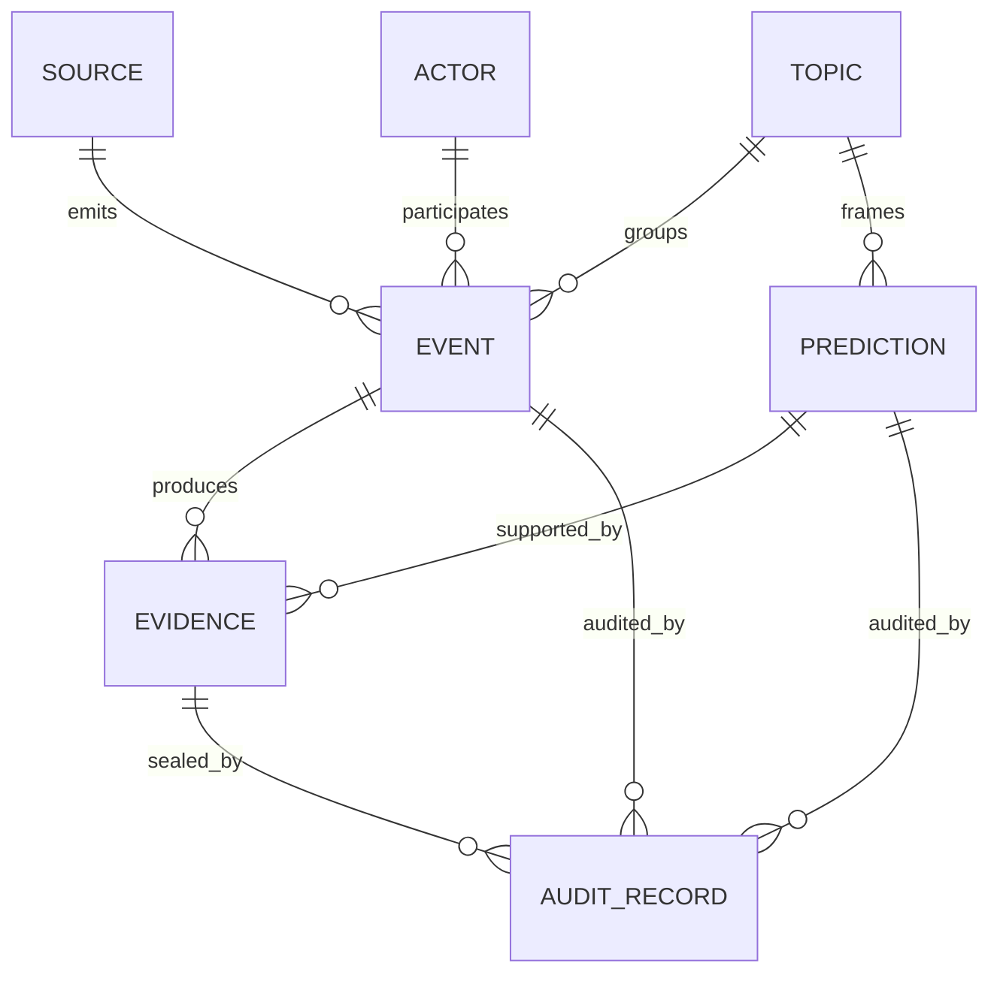
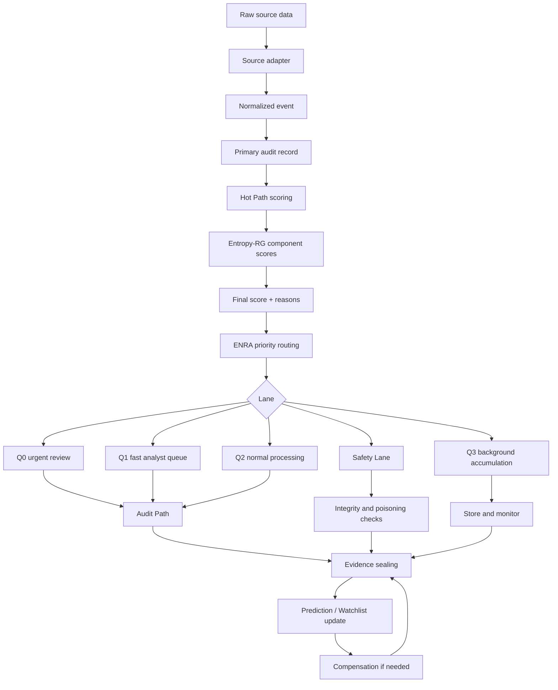

# Футуролог: архитектурный документ v1.0

## 1. Резюме проекта

«Футуролог» — это система раннего обнаружения слабых сигналов о будущих событиях в сложных средах: геополитике, рынках, технологиях, социальных трендах, корпоративных рисках, климатических и медицинских предупреждениях. Система не заявляет, что «предсказывает будущее» как оракул. Её задача практичнее: находить сигналы, которые начинают сохраняться во времени, проявляться на разных масштабах, подтверждаться независимыми источниками и оставлять проверяемый след доказательств.

Базовая проблема, которую решает проект: в реальных информационных потоках громкость сигнала часто не равна его значимости. Событие может быть шумным, массово обсуждаемым и при этом быстро исчезнуть. Другой сигнал может быть слабым, но устойчивым: сначала появляется в локальных источниках, затем повторяется в независимых наблюдениях, связывается с соседними темами, проходит через несколько временных окон и не объясняется простым всплеском медийного внимания. Именно такие сигналы интересны для раннего предупреждения.

Проект объединяет два ранее разработанных пакета:

1. **ENRA MVP v1.1** — инфраструктурный слой. Он отвечает за входные сигналы, маршрутизацию, очереди, приоритеты, быстрый и медленный контуры обработки, аудит, компенсационные события и отказоустойчивую организацию процесса.

2. **Entropy-RG Confinement Anomaly Detector v2.2** — алгоритмическое ядро. Он отвечает за вычисление аномальности и устойчивости сигнала через набор скоринговых компонент: `gibbs`, `residue`, `sequential`, `surprise`, `graph`, а также за интеграцию этих компонент через веса и confluence-логику.

Граница между пакетами принципиальна. ENRA не должен притворяться математическим ядром. Его роль — принимать, ставить в очередь, маршрутизировать, логировать, запускать проверку и обеспечивать исправление ошибок. Entropy-RG не должен притворяться продуктовой платформой. Его роль — оценивать структуру сигнала и возвращать скор, компоненты, причины и объяснения.

Для инвесторов, партнёров и инженерной команды ключевая ценность «Футуролога» состоит не в громком обещании «предсказывать события», а в построении проверяемой системы принятия решений. Каждый входной сигнал, промежуточный скор, доказательство, изменение статуса и итоговая гипотеза должны попадать в аудит-след. Этот аудит-след должен быть защищён от незаметного изменения через hash-chain или аналогичный механизм криптографического запечатывания.

Отличие от крупных классов систем вроде Recorded Future, Palantir или Predata формулируется осторожно. «Футуролог» не пытается копировать их полный масштаб, объём данных или зрелость enterprise-интеграций. Его отличие на уровне архитектурного принципа: прогноз или раннее предупреждение рассматривается как проверяемая цепочка доказательств, а не как финальный текстовый вывод аналитика или модели. Продуктом является не только сигнал, но и доказуемый путь его возникновения: из каких событий он собран, какие источники участвовали, какие проверки прошёл, когда и почему был повышен или понижен его статус.

Целевая аудитория проекта:

- аналитические команды, которым нужны ранние предупреждения;
- корпоративные risk-management подразделения;
- фонды, исследовательские группы и стратегические отделы;
- команды мониторинга информационных операций и социальных манипуляций;
- организации, которым важна воспроизводимость выводов и аудит решений.

Первая версия проекта должна быть реалистичной: не универсальный искусственный интеллект, а инженерная платформа для отбора, скоринга, маршрутизации и аудита weak signals.

## 2. Главная аксиома и принципы

Главная аксиома проекта:

> Быстрые решения допустимы только при наличии медленного механизма исправления.

Это означает, что Hot Path может быстро поднять сигнал в приоритет, но система не должна считать это окончательной истиной. Быстрый контур нужен для реакции. Медленный контур нужен для проверки, коррекции, объяснения, понижения статуса, отката и обучения на ошибках.

Из этой аксиомы следуют основные принципы.

### Слабый сигнал важнее громкого

Система не должна путать интенсивность обсуждения с объективностью тренда. Всплеск публикаций, репостов или ценовых движений может быть шумом, кампанией, паникой или следствием одного источника. Слабый сигнал становится важным только тогда, когда проявляет устойчивость:

- во времени;
- на разных масштабах;
- в независимых источниках;
- в связанных, но не идентичных темах;
- в графе акторов, событий и доказательств.

### Доказуемость как продукт

Финальный вывод без доказуемого пути возникновения имеет ограниченную ценность. В «Футурологе» важны не только `prediction` или `alert`, но и `evidence`, `audit_record`, `hash-chain`, история изменений статуса и причины каждого решения.

### Разделение интенсивности и объективности

Система должна различать две оси:

- насколько сигнал сильный прямо сейчас;
- насколько он объективирован через независимые признаки устойчивости.

Громкий, но нестабильный сигнал не должен автоматически попадать в высший приоритет. Слабый, но устойчивый сигнал может быть важнее краткосрочного шума.

### Компенсация вместо удаления истории

Ошибочные выводы не должны просто стираться. Они должны исправляться через компенсационные события. Это сохраняет честную историю системы: что она считала раньше, почему изменила решение, какие новые доказательства появились.

### Research inspiration без подмены инженерии

Entropy-RG использует идеи ренормгруппы и Yang-Mills/confinement как исследовательскую метафору устойчивости структуры сквозь масштабы. В продуктовой архитектуре это не физическая зависимость и не доказательство качества модели, а язык для описания многомасштабной фильтрации шума.

## 3. Доменная модель

Доменная модель «Футуролога» должна быть независима от маркетплейса. Поэтому термины `seller`, `listing`, `category` из Entropy-RG заменяются универсальными понятиями `actor`, `event`, `topic`.

### Actor

`Actor` — субъект или сущность, связанная с появлением, распространением или интерпретацией сигнала.

Примеры:

- медиа-издание;
- эксперт;
- компания;
- государственный орган;
- социальный аккаунт;
- исследовательская группа;
- рынок или биржевой инструмент;
- организация, производящая действия в реальном мире.

Actor не обязательно является человеком. Это может быть источник, институт, компания, бот-сеть, отраслевой сегмент или кластер.

Основные поля:

- `actor_id`;
- `actor_type`;
- `name`;
- `known_aliases`;
- `source_reliability_score`;
- `historical_accuracy_score`;
- `affiliations`;
- `created_at`;
- `updated_at`.

### Event

`Event` — атомарное наблюдение, из которого может быть построен сигнал.

Примеры:

- публикация новости;
- пост в соцсети;
- патентная заявка;
- изменение цены;
- заявление чиновника;
- новая вакансия в компании;
- необычный паттерн закупок;
- научная публикация;
- локальное сообщение о протесте, дефиците или техническом сбое.

Основные поля:

- `event_id`;
- `source_id`;
- `actor_id`;
- `topic_id`;
- `timestamp`;
- `event_type`;
- `raw_payload`;
- `normalized_text`;
- `language`;
- `location`;
- `extracted_entities`;
- `content_hash`;
- `ingested_at`.

### Source

`Source` — канал, из которого поступают события.

Примеры:

- RSS;
- API новостных систем;
- социальные сети;
- базы патентов;
- финансовые данные;
- научные репозитории;
- государственные сайты;
- внутренние корпоративные системы.

Основные поля:

- `source_id`;
- `source_type`;
- `name`;
- `access_method`;
- `reliability_score`;
- `latency_profile`;
- `license_constraints`;
- `last_ingested_at`.

### Evidence

`Evidence` — проверяемый фрагмент, подтверждающий или ослабляющий сигнал.

Evidence отличается от Event тем, что Event — это входное наблюдение, а Evidence — уже отобранный объект доказательной цепочки.

Основные поля:

- `evidence_id`;
- `event_id`;
- `claim_id` или `prediction_id`;
- `evidence_type`;
- `summary`;
- `source_url`;
- `retrieved_at`;
- `content_hash`;
- `reliability_score`;
- `supports_or_refutes`;
- `sealed_at`.

### Topic

`Topic` — тематический контейнер, в котором группируются события, акторы и сигналы.

Примеры:

- «экспортные ограничения чипов»;
- «нестабильность в регионе X»;
- «рост спроса на литий»;
- «социальная напряжённость вокруг тарифов»;
- «ранние признаки эпидемиологического риска».

Основные поля:

- `topic_id`;
- `parent_topic_id`;
- `name`;
- `description`;
- `keywords`;
- `embedding`;
- `category_coupling`;
- `created_at`.

### Prediction

`Prediction` — формализованный вывод системы о возможном будущем событии или тренде. В первой версии лучше использовать более осторожные статусы: `hypothesis`, `early_warning`, `watchlist_item`, `confirmed_trend_candidate`.

Основные поля:

- `prediction_id`;
- `topic_id`;
- `title`;
- `statement`;
- `time_horizon`;
- `confidence_score`;
- `objectivity_score`;
- `intensity_score`;
- `final_score`;
- `status`;
- `created_at`;
- `updated_at`;
- `sealed_audit_head`.

### Audit Record

`Audit Record` — запись о действии системы.

Примеры:

- сигнал получен;
- скор рассчитан;
- событие отправлено в Q1;
- доказательство добавлено;
- прогноз повышен в статусе;
- прогноз понижен;
- создано compensation event;
- изменены веса скоринга.

Основные поля:

- `audit_id`;
- `entity_type`;
- `entity_id`;
- `action_type`;
- `actor_system`;
- `timestamp`;
- `before_state_hash`;
- `after_state_hash`;
- `payload_hash`;
- `previous_audit_hash`;
- `current_audit_hash`.

### Связи между сущностями



## 4. Архитектурные слои

### 4.1. Слой 1: Сбор и нормализация сигналов

Этот слой отвечает за приём данных из разных источников и приведение их к единому виду `event`.

Вход:

- новости;
- посты;
- документы;
- финансовые ряды;
- патенты;
- научные публикации;
- государственные реестры;
- внутренние корпоративные данные.

Выход:

- нормализованный `event`;
- первичный `source`;
- связанный `actor`, если он определён;
- связанный `topic`, если классификация возможна;
- `content_hash` для защиты от незаметной подмены содержимого.

Функции слоя:

- адаптеры под источники;
- очистка и нормализация текста;
- извлечение времени, места, акторов, сущностей;
- дедупликация;
- первичная классификация по topic;
- сохранение raw payload;
- создание первичной audit-записи.

Здесь работает инфраструктурная часть ENRA: входной API, первичная валидация, постановка в очередь и базовый audit path. Entropy-RG на этом этапе ещё не должен принимать окончательных решений, но может получать подготовленные признаки.

Пример адаптера:

```text
NewsAdapter -> RawArticle -> NormalizedEvent
PatentAdapter -> RawPatentRecord -> NormalizedEvent
MarketAdapter -> RawPriceMove -> NormalizedEvent
SocialAdapter -> RawPost -> NormalizedEvent
```

Важное требование: raw data не должна теряться. Даже если нормализация ошиблась, система должна иметь возможность вернуться к исходному объекту и создать compensation event.

### 4.2. Слой 2: Hot Path — быстрая оценка через Entropy-RG scoring

Hot Path — быстрый контур оценки. Его задача не в том, чтобы вынести окончательный вердикт, а в том, чтобы определить, требует ли сигнал немедленного внимания, глубокого аудита или обычного накопления.

Вход:

- нормализованный `event`;
- история событий по actor/topic;
- baseline по trusted sources;
- граф связей;
- последние скоринговые состояния.

Выход:

- `component_scores`;
- `final_score`;
- `reasons`;
- `recommended_lane`;
- `requires_audit`;
- `confidence_bounds`, если реализовано.

Пять компонент Entropy-RG адаптируются так:

- `gibbs` — оценка отклонения от ожидаемого распределения;
- `residue` — информационный остаток, сохраняющийся после укрупнения масштаба;
- `sequential` — накопление последовательных подтверждений во времени;
- `surprise` — редкость события относительно baseline;
- `graph` — структурная значимость в графе акторов, источников и тем.

Hot Path должен вернуть не только число, но и объяснение. Например:

```json
{
  "event_id": "evt_123",
  "topic_id": "topic_chip_export_controls",
  "component_scores": {
    "gibbs": 0.68,
    "residue": 0.74,
    "sequential": 0.61,
    "surprise": 0.82,
    "graph": 0.55
  },
  "confluence_bonus": 0.08,
  "final_score": 0.73,
  "recommended_lane": "Q1",
  "reasons": [
    "rare_event_relative_to_topic_baseline",
    "persistent_across_time_windows",
    "confirmed_by_independent_sources"
  ]
}
```

### 4.3. Слой 3: Priority lanes

Priority lanes — это слой ENRA, который решает, как быстро и глубоко обрабатывать сигнал.

Базовая модель:

- `Q0` — критические сигналы, требующие немедленной реакции;
- `Q1` — важные сигналы, требующие быстрого аналитического внимания;
- `Q2` — обычные сигналы для плановой обработки;
- `Q3` — низкий приоритет, накопление и фоновая аналитика;
- `Safety Lane` — отдельный контур для ошибок, конфликтов, подозрений на poisoning, нарушения целостности audit path или необычного поведения системы.

Entropy-RG не должен напрямую выполнять бизнес-действия. Он рекомендует lane. ENRA принимает это решение с учётом инфраструктурных правил:

- текущая нагрузка;
- доступность worker;
- rate limit источников;
- системные инциденты;
- политика клиента;
- safety constraints.

Пример маппинга:

```text
final_score >= 0.85 and evidence_conflict == false -> Q0 candidate
final_score >= 0.65 -> Q1
final_score >= 0.40 -> Q2
final_score < 0.40 -> Q3
audit_integrity_error == true -> Safety Lane
suspected_poisoning == true -> Safety Lane
```

Q0 должен использоваться осторожно. Для первой версии лучше считать Q0 не автоматическим «истинным кризисом», а кандидатом на срочную человеческую проверку.

### 4.4. Слой 4: Audit Path — отложенная глубокая верификация

Audit Path — медленный контур, который исправляет главный риск Hot Path: быстрое решение может быть ошибочным.

Функции Audit Path:

- повторная проверка источников;
- сравнение с независимыми данными;
- поиск дубликатов и первоисточника;
- проверка временной последовательности;
- пересчёт score на расширенном окне;
- проверка графовых связей;
- выявление информационных кампаний;
- формирование объяснимого отчёта;
- повышение, понижение или заморозка статуса prediction.

В ENRA Audit Path уже существует как инфраструктурная идея. Entropy-RG делает его содержательным, потому что предоставляет компоненты, которые можно проверять отдельно.

Пример вопросов Audit Path:

- Почему `surprise` высокий?
- Это действительно редкое событие или baseline неполный?
- Почему `sequential` растёт?
- Есть ли независимые подтверждения или один источник породил каскад перепечаток?
- Почему `graph` значим?
- Это новый мост между кластерами или артефакт плохой дедупликации?
- Сохраняется ли `residue` при укрупнении event → topic → macro-topic?

Audit Path не должен только подтверждать Hot Path. Его равноправная задача — опровергать, снижать статус и создавать compensation event.

### 4.5. Слой 5: Evidence sealing — hash-chain и криптографический архив

Evidence sealing превращает систему из обычного скорингового движка в проверяемую платформу.

Цели слоя:

- зафиксировать, какие данные были доступны системе на момент решения;
- защитить audit trail от незаметного изменения;
- дать партнёру или клиенту возможность проверить историю вывода;
- сохранить доказательства даже после изменения статуса прогноза.

Базовый механизм:

```text
current_audit_hash = HMAC(
    secret_key,
    previous_audit_hash + canonical_payload_hash + timestamp + action_type
)
```

Для первой версии достаточно HMAC и SQLite/PostgreSQL audit log. В дальнейшем можно добавить внешнее якорение hash-head: например, регулярную публикацию агрегированного hash-head во внешний immutable storage или timestamping-сервис. Это не является обязательным для MVP.

Запечатываться должны:

- raw event hash;
- normalized event hash;
- evidence hash;
- scoring payload hash;
- decision payload hash;
- previous audit hash;
- current audit hash;
- версия модели или конфигурации scoring.

Важно: hash-chain не доказывает, что прогноз правильный. Он доказывает, что история возникновения прогноза не была незаметно переписана.

### 4.6. Слой 6: Compensation — откаты, корректировки, обучение на ошибках

Compensation — механизм исправления без удаления истории.

Типовые ситуации:

- источник оказался ненадёжным;
- событие было фальшивым;
- baseline был отравлен;
- тема была классифицирована неверно;
- графовая связь оказалась артефактом;
- прогноз был слишком рано повышен в статусе;
- после новых данных score должен быть пересчитан.

Вместо удаления старого решения создаётся новое событие:

```text
PredictionPromoted -> EvidenceConflictDetected -> PredictionDowngraded
```

или:

```text
EventIngested -> ScoreComputed -> PoisoningSuspected -> SafetyLaneRouted -> BaselineRebuilt
```

Compensation events должны попадать в тот же audit path и hash-chain. Это позволяет честно показать не только успешные ранние предупреждения, но и ошибки системы, а также то, как они исправлялись.

## 5. Поток обработки сигнала

Общий поток обработки:



Таблица ответственности:

| Шаг | Описание | Ответственный пакет |
|---|---|---|
| Приём данных | API, адаптеры, первичная валидация | ENRA |
| Нормализация | Приведение к `event`, `actor`, `topic` | ENRA + доменные адаптеры |
| Первичный audit | Запись факта поступления | ENRA |
| Hot Path scoring | Расчёт компонент аномальности | Entropy-RG |
| Интеграция score | Веса, confluence, final score | Entropy-RG |
| Priority routing | Q0/Q1/Q2/Q3/Safety Lane | ENRA |
| Audit Path | Глубокая проверка и пересчёт | ENRA вызывает Entropy-RG |
| Evidence sealing | HMAC/hash-chain, архив | ENRA security/audit layer |
| Compensation | Откаты и корректировки | ENRA |
| Baseline calibration | Анализ распределений и настройка весов | Entropy-RG + offline jobs |

Минимальный контракт между ENRA и Entropy-RG:

```python
class ScoringInput:
    event_id: str
    actor_id: str | None
    topic_id: str
    timestamp: str
    features: dict
    history_window: dict
    graph_context: dict
    baseline_context: dict

class ScoringOutput:
    component_scores: dict
    confluence_bonus: float
    final_score: float
    reasons: list[str]
    recommended_lane: str
    model_version: str
```

ENRA не должен знать внутреннюю математику каждого score. Entropy-RG не должен знать детали Redis, priority worker и compensation workflow. Их связь — через стабильный интерфейс.

## 6. Математика scoring

Этот раздел описывает математику на уровне архитектурного контракта. Полный вывод и детали реализации должны находиться в коде Entropy-RG и соответствующих README.

### 6.1. Gibbs score

`gibbs` оценивает отклонение события от ожидаемого состояния темы или категории. В адаптации для «Футуролога» это отклонение события от baseline по topic, actor или source.

Упрощённо:

```text
gibbs_score = f(energy_like_deviation, entropy_like_background)
```

Практически это может выражаться через нормированное отклонение признаков от ожидаемого распределения. Смысл компоненты: событие необычно не само по себе, а относительно контекста.

Пример:

- резкий рост упоминаний темы в одном источнике может быть незначимым;
- тот же рост в источнике, который обычно молчит по этой теме, может получить более высокий `gibbs`.

### 6.2. Residue score

`residue` — ключевая компонента Entropy-RG. Она отвечает на вопрос: остаётся ли сигнал после укрупнения масштаба?

В маркетплейсе масштаб был:

```text
listing -> seller -> cluster -> category -> graph
```

В «Футурологе» масштаб становится:

```text
event -> actor -> topic -> macro-topic -> cross-domain graph
```

Идея:

```text
residue = persistence(signal, scales)
```

Если сигнал исчезает при переходе от одного события к теме, он похож на шум. Если сохраняется на нескольких уровнях, он становится кандидатом на структурный weak signal.

Пример:

- один пост о дефиците товара — слабое событие;
- несколько локальных сообщений, связанные закупки, рост цен и заявления компаний — сигнал, сохраняющийся через масштабы.

### 6.3. Sequential score

`sequential` оценивает накопление подтверждений во времени. Один сильный сигнал может быть менее важен, чем серия умеренных, но согласованных сигналов.

Упрощённо:

```text
sequential_score_t = update(sequential_score_t-1, new_evidence, decay)
```

Где `decay` нужен, чтобы старые подтверждения постепенно теряли вес.

Смысл:

- сигнал растёт, если новые события подтверждают ту же гипотезу;
- сигнал затухает, если подтверждения прекращаются;
- сигнал должен снижаться, если появляются опровержения или конфликтные evidence.

### 6.4. Surprise score

`surprise` оценивает редкость события относительно baseline. В Entropy-RG упоминается робастный z-score через MAD и гауссовский tail probability.

Робастная форма:

```text
robust_z = (x - median(x_window)) / (MAD(x_window) + epsilon)
```

Далее:

```text
surprise_score = tail_probability(robust_z)
```

MAD нужен, потому что реальные данные часто загрязнены выбросами. Обычное среднее и стандартное отклонение могут быть неустойчивыми.

Пример:

- обычное количество публикаций по теме — baseline;
- резкое отклонение от медианы за окно времени — surprise;
- если отклонение поддержано независимыми источниками, surprise усиливает общий score;
- если отклонение вызвано одним источником или бот-сетью, Audit Path должен снизить доверие.

### 6.5. Graph score

`graph` оценивает структурное положение сигнала в графе.

В маркетплейсной версии graph layer был ограничен переиспользованием контактов. Для «Футуролога» требуется более общий граф:

- actor ↔ actor;
- actor ↔ source;
- source ↔ topic;
- event ↔ evidence;
- topic ↔ topic;
- prediction ↔ evidence;
- claim ↔ refutation.

Возможные признаки:

- появление нового моста между кластерами;
- подтверждение из независимых частей графа;
- рост центральности темы;
- необычная синхронность акторов;
- подозрительно плотный однотипный кластер, похожий на кампанию.

На MVP-этапе graph score может быть простым: количество независимых источников, разнообразие actor types, отсутствие общего первоисточника, базовая связность topic graph. Более сложные графовые метрики следует оставить на следующую итерацию.

### 6.6. Интеграция компонент и confluence

Финальный score может быть рассчитан как взвешенная сумма компонент с confluence-бонусом:

```text
base_score =
    w_gibbs * gibbs +
    w_residue * residue +
    w_sequential * sequential +
    w_surprise * surprise +
    w_graph * graph

final_score = clip(base_score + confluence_bonus, 0, 1)
```

Confluence-бонус начисляется не за высокий score одной компоненты, а за согласованность нескольких независимых компонент.

Пример:

```text
if residue > 0.65 and sequential > 0.60 and surprise > 0.70:
    confluence_bonus += 0.05

if graph > 0.60 and source_redundancy > threshold:
    confluence_bonus += 0.03
```

Это снижает риск зависимости от одного показателя. Сильный `surprise` без `sequential` и `residue` может быть просто всплеском. Умеренный `surprise`, но высокий `residue`, `sequential` и `graph` может быть более важным.

### 6.7. Калибровка

Entropy-RG содержит идею calibration.py для анализа распределения скоров и подгонки весов. Для «Футуролога» калибровка должна стать обязательной частью offline pipeline.

Что нужно калибровать:

- веса компонент;
- пороги Q0/Q1/Q2/Q3;
- decay для sequential;
- baseline по topic;
- надёжность источников;
- penalty за зависимые источники;
- правила confluence.

Калибровка должна проводиться отдельно по доменам. Геополитические сигналы, технологические тренды и финансовые события не обязаны иметь одинаковые пороги.

## 7. Применения

### 7.1. Геополитический форсайт

Вход:

- новости;
- локальные медиа;
- заявления государственных органов;
- спутниковые или открытые логистические данные, если доступны;
- социальные сообщения;
- санкционные и торговые документы.

Выход:

- watchlist по региону или теме;
- ранние предупреждения;
- evidence chain;
- изменение статуса риска;
- отчёт для аналитика.

Клиент:

- аналитическая группа;
- корпоративный security/risk department;
- фонд или исследовательская организация.

Пример: система замечает, что локальные сообщения о перебоях поставок, заявления чиновников, изменение логистических маршрутов и рост цен на отдельные товары начинают сходиться в одном topic. Hot Path поднимает сигнал в Q1, Audit Path проверяет первоисточники и независимость evidence.

### 7.2. Технологическое сканирование

Вход:

- патенты;
- научные публикации;
- вакансии компаний;
- GitHub/release notes, если разрешено;
- отчёты компаний;
- инвестиционные новости.

Выход:

- emerging technology watchlist;
- карта акторов;
- признаки ускорения темы;
- evidence chain по каждому тренду.

Клиент:

- R&D department;
- венчурный фонд;
- стратегический отдел компании.

Пример: тема долго была слабой, но начинает проявляться одновременно в патентах, найме специалистов, публикациях и закупках оборудования. Это может получить высокий `residue` и `sequential`, даже если медийный шум пока низкий.

### 7.3. Антиманипуляция в соцмедиа

Вход:

- посты;
- репосты;
- временные паттерны публикаций;
- связи аккаунтов;
- источники первичного нарратива;
- внешние факты для проверки.

Выход:

- сигнал о возможной координированной кампании;
- граф распространения;
- оценка независимости источников;
- список evidence;
- направление в Safety Lane при подозрении на poisoning.

Клиент:

- команда trust & safety;
- медиааналитики;
- корпоративные коммуникации;
- исследователи информационных операций.

Пример: громкий нарратив растёт быстро, но graph score показывает зависимость от узкого кластера аккаунтов, а source redundancy низкая. Система не повышает прогноз автоматически, а отправляет кейс в Safety Lane или Audit Path.

### 7.4. Корпоративный риск-менеджмент

Вход:

- новости о поставщиках;
- судебные документы;
- финансовые показатели;
- логистические задержки;
- внутренние инциденты;
- сигналы от отделов закупок и compliance.

Выход:

- раннее предупреждение о поставщике, регионе или категории риска;
- evidence trail;
- рекомендации по приоритету проверки;
- история изменения риска.

Клиент:

- risk-management отдел;
- procurement;
- compliance;
- executive office.

Пример: один поставщик получает несколько слабых сигналов: задержки, локальные новости, судебные упоминания, нестандартные изменения цен. По отдельности они не критичны, но sequential и residue растут, поэтому кейс попадает в Q1.

### 7.5. Climate/health early warning

Вход:

- погодные аномалии;
- локальные сообщения;
- медицинская статистика, если доступна законно;
- данные о госпитализациях;
- отчёты местных органов;
- цепочки поставок критических товаров.

Выход:

- ранний watchlist по региону;
- вероятные зоны ухудшения;
- evidence chain;
- динамика confidence.

Клиент:

- НКО;
- исследовательская группа;
- муниципальные или корпоративные risk teams;
- страховые аналитики.

Пример: слабые локальные сообщения о заболевании, рост спроса на лекарства и нетипичная динамика обращений в регионе могут быть сигналом для наблюдения. Система не ставит диагноз и не заменяет медицинские органы, а поднимает проверяемый early warning.

## 8. Дорожная карта

### 8.1. Что готово по исходным пакетам

По описанию ENRA MVP v1.1 уже задана инфраструктурная рамка:

- FastAPI backend;
- Redis priority queues;
- очереди Q0/Q1/Q2/Q3;
- Safety Lane;
- priority worker;
- audit path;
- compensation events;
- термины и сценарии обработки.

По описанию Entropy-RG v2.2 уже задано алгоритмическое ядро:

- многокомпонентный scoring;
- `gibbs`, `residue`, `sequential`, `surprise`, `graph`;
- robust z-score через MAD;
- tail probability;
- exponential decay;
- category coupling;
- sequential evidence accumulation;
- confluence bonus;
- calibration.py;
- trusted baseline;
- HMAC;
- CSV injection protection;
- SQLite audit log;
- Streamlit dashboard как reference UX.

Для «Футуролога» это означает: есть инфраструктурный скелет и есть математическое ядро, но их нужно связать через доменно-независимый контракт.

### 8.2. Следующая итерация

Цель следующей итерации — собрать работающий вертикальный срез.

Приоритетные задачи:

1. **Единая доменная модель.**  
   Заменить `seller/listing/category` на `actor/event/topic` в адаптационном слое, не ломая исходную математику Entropy-RG.

2. **Scoring interface.**  
   Создать стабильный контракт `ScoringInput -> ScoringOutput` между ENRA и Entropy-RG.

3. **Hot Path integration.**  
   Подключить Entropy-RG scoring к ENRA worker так, чтобы результат scoring определял recommended lane.

4. **Audit event schema.**  
   Формализовать audit records для event, score, routing decision, evidence sealing и compensation.

5. **Hash-chain MVP.**  
   Реализовать HMAC-based hash-chain для audit records. Не обещать внешнюю блокчейн-якоризацию на MVP-этапе.

6. **Минимальные адаптеры источников.**  
   Для пилота выбрать 2–3 источника, например RSS/news, ручной CSV/JSON импорт, один структурированный источник.

7. **Калибровка на синтетических и исторических данных.**  
   Проверить распределение score, пороги очередей и поведение confluence.

8. **Dashboard v0.1.**  
   Не переносить Streamlit dashboard дословно. Использовать его как reference. Для MVP достаточно экрана: входные события, score components, lane, evidence, audit chain.

9. **Human review loop.**  
   Добавить ручное подтверждение, понижение, комментарий аналитика и compensation event.

### 8.3. Long-term

Долгосрочные задачи, не обязательные для MVP:

- расширение графовой модели;
- более строгая оценка независимости источников;
- автоматизированная оценка качества evidence;
- доменные calibration packs;
- поддержка нескольких клиентов с изолированными baseline;
- внешнее timestamping-якорение audit hash-head;
- backtesting по историческим кейсам;
- сравнение качества с простыми baseline-моделями;
- API для партнёров;
- экспорт отчётов для compliance и board-level review;
- мониторинг poisoning и drift;
- библиотека типовых сценариев: geopolitical, tech, social manipulation, corporate risk.

Не следует обещать в roadmap:

- гарантированное предсказание событий;
- AGI-агентов;
- квантовые вычисления;
- полностью автономные геополитические решения;
- универсальную точность во всех доменах без калибровки.

## 9. Ограничения и риски

### 9.1. Ограничения

Система не доказывает будущее. Она оценивает устойчивость weak signals и формирует проверяемые предупреждения.

Качество результата зависит от источников. Если источники неполные, зависимые или отравленные, score может быть искажён.

Один и тот же scoring не подходит для всех доменов. Геополитика, рынки, технологии и health signals требуют разных baseline, decay и thresholds.

Graph layer в первой версии должен быть скромным. Настоящий граф независимости источников и акторов — отдельная инженерная задача.

Hash-chain защищает историю записей, но не гарантирует истинность самих данных. Если ложное событие было честно запечатано, hash-chain докажет только то, что система действительно его видела.

### 9.2. Риски

Основные риски:

- ложные срабатывания на медийный шум;
- пропуск слабого сигнала из-за бедного baseline;
- зависимость нескольких источников от одного первоисточника;
- poisoning trusted baseline;
- чрезмерная вера пользователя в final score;
- сложность объяснения компонент неспециалистам;
- преждевременное использование Q0;
- перенос маркетплейсных терминов в новый домен без адаптации.

### 9.3. Меры снижения рисков

Для MVP нужны следующие защитные меры:

- разделять intensity и objectivity;
- показывать component scores, а не только final score;
- хранить reasons;
- отправлять конфликтные случаи в Safety Lane;
- использовать compensation events вместо удаления;
- калибровать пороги по каждому домену;
- не скрывать uncertainty;
- требовать human review для Q0/Q1 на раннем этапе;
- сохранять raw data и normalized data;
- фиксировать model/config version в audit path.

## 10. Итоговая архитектурная формула

Коротко проект можно описать так:

```text
Футуролог = ENRA orchestration layer + Entropy-RG scoring core + sealed evidence trail
```

ENRA отвечает за процесс:

```text
ingest -> queue -> route -> audit -> compensate
```

Entropy-RG отвечает за оценку:

```text
event/history/graph/baseline -> component scores -> confluence -> final score
```

Evidence sealing отвечает за доверие:

```text
event -> evidence -> score -> decision -> audit hash-chain
```

Главная инженерная граница:

```text
ENRA решает, как система живёт.
Entropy-RG решает, насколько сигнал структурно значим.
Hash-chain показывает, почему система так решила и что было известно на тот момент.
```

Эта граница должна сохраняться во всех следующих итерациях. Если её размыть, ENRA снова станет декоративной инфраструктурой без математики, а Entropy-RG — исследовательским алгоритмом без продуктовой надёжности.
