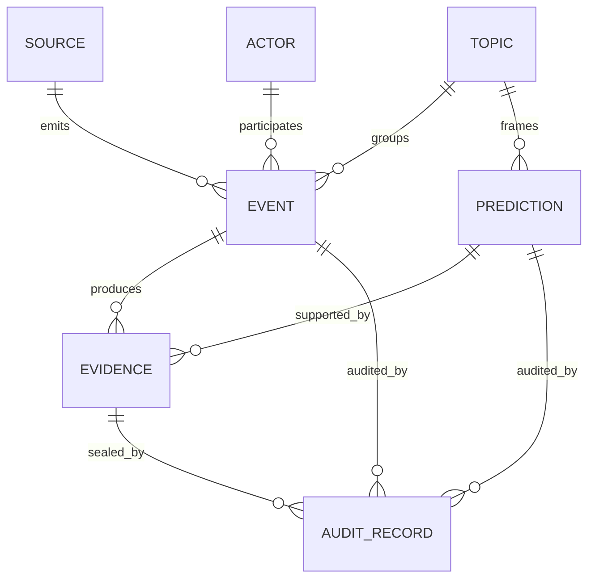
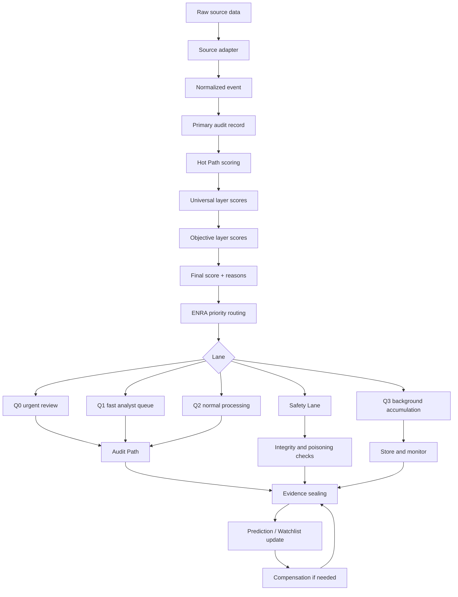

# Футуролог: архитектурный документ v1.1

## Changelog относительно v1.0

1. Добавлена двухслойная scoring-модель ERG-CAD: `universal_risk` и `objective_risk`.
2. Зафиксирована финальная формула с мягким objective-множителем и отдельным trust adjustment.
3. Раздел «Математика scoring» полностью обновлён под canonical scoring model.
4. Добавлены 12 canonical scoring-компонент: 7 в universal layer и 5 в objective layer.
5. Введены `weights_version = "preprint-v1-uncalibrated"` и `calibration_status`.
6. Обновлён контракт `ScoringInput -> ScoringOutput`.
7. Roadmap переписан как milestones M1–M9.
8. Добавлены ограничения по неоткалиброванным весам, objective-заглушкам и transitional API.
9. Добавлен раздел 11: теоретическая основа ERG-CAD.
10. Сохранён инженерный тон v1.0 без маркетинговых обещаний.

## 1. Резюме проекта

«Футуролог» — это система раннего обнаружения слабых сигналов о будущих событиях в сложных средах: геополитике, рынках, технологиях, социальных трендах, корпоративных рисках, климатических и медицинских предупреждениях. Система не заявляет, что «предсказывает будущее» как оракул. Её задача практичнее: находить сигналы, которые начинают сохраняться во времени, проявляться на разных масштабах, подтверждаться независимыми источниками и оставлять проверяемый след доказательств.

Архитектурно «Футуролог» различает интенсивность риска и его объективность как два независимых измерения, что отражается в двухслойной формуле scoring. Базовая проблема, которую решает проект: в реальных информационных потоках громкость сигнала часто не равна его значимости. Событие может быть шумным, массово обсуждаемым и при этом быстро исчезнуть. Другой сигнал может быть слабым, но устойчивым: сначала появляется в локальных источниках, затем повторяется в независимых наблюдениях, связывается с соседними темами, проходит через несколько временных окон и не объясняется простым всплеском медийного внимания. Именно такие сигналы интересны для раннего предупреждения.

Проект объединяет два ранее разработанных пакета:

1. **ENRA MVP v1.1** — инфраструктурный слой. Он отвечает за входные сигналы, маршрутизацию, очереди, приоритеты, быстрый и медленный контуры обработки, аудит, компенсационные события и отказоустойчивую организацию процесса.

2. **Entropy-RG Confinement Anomaly Detector v2.2 / v3.x** — алгоритмическое ядро. Он отвечает за вычисление компонент риска, их интеграцию, объяснения, калибровку и передачу результата в ENRA Hot Path.

Граница между пакетами принципиальна. ENRA не должен притворяться математическим ядром. Его роль — принимать, ставить в очередь, маршрутизировать, логировать, запускать проверку и обеспечивать исправление ошибок. Entropy-RG не должен притворяться продуктовой платформой. Его роль — оценивать структуру сигнала и возвращать скор, компоненты, причины, версию весов, статус калибровки и объяснения.

Для инвесторов, партнёров и инженерной команды ключевая ценность «Футуролога» состоит не в громком обещании «предсказывать события», а в построении проверяемой системы принятия решений. Каждый входной сигнал, промежуточный скор, доказательство, изменение статуса и итоговая гипотеза должны попадать в аудит-след. Этот аудит-след должен быть защищён от незаметного изменения через hash-chain или аналогичный механизм криптографического запечатывания.

## 2. Главная аксиома и принципы

Главная аксиома проекта:

> Быстрые решения допустимы только при наличии медленного механизма исправления.

Hot Path может быстро поднять сигнал в приоритет, но система не должна считать это окончательной истиной. Быстрый контур нужен для реакции. Медленный контур нужен для проверки, коррекции, объяснения, понижения статуса, отката и обучения на ошибках.

### Слабый сигнал важнее громкого

Система не должна путать интенсивность обсуждения с объективностью тренда. Всплеск публикаций, репостов или ценовых движений может быть шумом, кампанией, паникой или следствием одного источника. Слабый сигнал становится важным только тогда, когда проявляет устойчивость во времени, на разных масштабах, в независимых источниках, в связанных темах и в структуре акторов, событий и доказательств.

### Доказуемость как продукт

Финальный вывод без доказуемого пути возникновения имеет ограниченную ценность. В «Футурологе» важны не только `prediction` или `alert`, но и `evidence`, `audit_record`, `hash-chain`, история изменений статуса и причины каждого решения.

### Разделение интенсивности и объективности

Universal layer отвечает за интенсивность риска. Objective layer отвечает за устойчивость и проверяемость. Финальный score является функцией обоих слоёв и отдельного trust adjustment:

```text
final_score =
    universal_risk
    × (α + (1 − α) × objective_risk)
    − γ × trust_adjustment
```

В стартовой версии:

```text
α = 0.3
γ ∈ [0.05, 0.10]
weights_version = "preprint-v1-uncalibrated"
```

Это означает: система уже учитывает objective layer, но не обнуляет сигнал полностью, если objective-компоненты ещё не реализованы или не откалиброваны. По мере накопления данных и калибровки `α` может снижаться к 0.

### Компенсация вместо удаления истории

Ошибочные выводы не должны просто стираться. Они должны исправляться через компенсационные события. Это сохраняет честную историю системы: что она считала раньше, почему изменила решение, какие новые доказательства появились.

### Research inspiration без подмены инженерии

Entropy-RG использует идеи ренормгруппы, coarse-graining и confinement-like нормирования как исследовательскую метафору устойчивости структуры сквозь масштабы. В продуктовой архитектуре это не физическая зависимость и не доказательство качества модели, а язык для описания многомасштабной фильтрации шума.

## 3. Доменная модель

Доменная модель «Футуролога» остаётся прежней: `actor`, `event`, `source`, `evidence`, `topic`, `prediction`, `audit_record`.

### Actor

`Actor` — субъект или сущность, связанная с появлением, распространением или интерпретацией сигнала. Это может быть медиа-издание, эксперт, компания, государственный орган, социальный аккаунт, исследовательская группа, рынок, биржевой инструмент или организация.

Основные поля: `actor_id`, `actor_type`, `name`, `known_aliases`, `source_reliability_score`, `historical_accuracy_score`, `affiliations`, `created_at`, `updated_at`.

### Event

`Event` — атомарное наблюдение, из которого может быть построен сигнал: публикация новости, пост, патентная заявка, изменение цены, заявление, новая вакансия, необычный паттерн закупок, научная публикация, локальное сообщение о сбое или протесте.

Основные поля: `event_id`, `source_id`, `actor_id`, `topic_id`, `timestamp`, `event_type`, `raw_payload`, `normalized_text`, `language`, `location`, `extracted_entities`, `content_hash`, `ingested_at`.

### Source

`Source` — канал, из которого поступают события: RSS, API новостных систем, социальные сети, базы патентов, финансовые данные, научные репозитории, государственные сайты, внутренние корпоративные системы.

Основные поля: `source_id`, `source_type`, `name`, `access_method`, `reliability_score`, `latency_profile`, `license_constraints`, `last_ingested_at`.

### Evidence

`Evidence` — проверяемый фрагмент, подтверждающий или ослабляющий сигнал. Evidence отличается от Event тем, что Event — это входное наблюдение, а Evidence — уже отобранный объект доказательной цепочки.

Основные поля: `evidence_id`, `event_id`, `claim_id` или `prediction_id`, `evidence_type`, `summary`, `source_url`, `retrieved_at`, `content_hash`, `reliability_score`, `supports_or_refutes`, `sealed_at`.

### Topic

`Topic` — тематический контейнер, в котором группируются события, акторы и сигналы. Примеры: экспортные ограничения чипов, нестабильность в регионе, рост спроса на литий, социальная напряжённость вокруг тарифов.

Основные поля: `topic_id`, `parent_topic_id`, `name`, `description`, `keywords`, `embedding`, `topic_coupling`, `created_at`.

### Prediction

`Prediction` — формализованный вывод системы о возможном будущем событии или тренде. В первой версии лучше использовать осторожные статусы: `hypothesis`, `early_warning`, `watchlist_item`, `confirmed_trend_candidate`.

Основные поля: `prediction_id`, `topic_id`, `title`, `statement`, `time_horizon`, `confidence_score`, `objectivity_score`, `intensity_score`, `final_score`, `status`, `created_at`, `updated_at`, `sealed_audit_head`.

### Audit Record

`Audit Record` — запись о действии системы: сигнал получен, score рассчитан, событие отправлено в очередь, evidence добавлено, прогноз повышен или понижен, создано compensation event, изменены веса.

Основные поля: `audit_id`, `entity_type`, `entity_id`, `action_type`, `actor_system`, `timestamp`, `before_state_hash`, `after_state_hash`, `payload_hash`, `previous_audit_hash`, `current_audit_hash`.




## 4. Архитектурные слои

### 4.1. Слой 1: Сбор и нормализация сигналов

Этот слой отвечает за приём данных из разных источников и приведение их к единому виду `event`.

Вход: новости, посты, документы, финансовые ряды, патенты, научные публикации, государственные реестры, внутренние корпоративные данные.

Выход: нормализованный `event`, первичный `source`, связанный `actor`, связанный `topic`, `content_hash` для защиты от незаметной подмены содержимого.

Функции слоя: адаптеры под источники, очистка текста, извлечение времени, места, акторов и сущностей, дедупликация, первичная topic-классификация, сохранение raw payload, создание первичной audit-записи.

```text
NewsAdapter -> RawArticle -> NormalizedEvent
PatentAdapter -> RawPatentRecord -> NormalizedEvent
MarketAdapter -> RawPriceMove -> NormalizedEvent
SocialAdapter -> RawPost -> NormalizedEvent
```

Важное требование: raw data не должна теряться. Даже если нормализация ошиблась, система должна иметь возможность вернуться к исходному объекту и создать compensation event.

### 4.2. Слой 2: Hot Path — быстрая оценка через Entropy-RG scoring

Hot Path — быстрый контур оценки. Его задача не в том, чтобы вынести окончательный вердикт, а в том, чтобы определить, требует ли сигнал немедленного внимания, глубокого аудита или обычного накопления.

В v1.1 Hot Path использует двухслойную scoring-модель:

1. **Universal layer** — оценивает интенсивность риска.
2. **Objective layer** — оценивает устойчивость и проверяемость риска.
3. **Trust adjustment** — отдельный modifier, который вычитается из итогового score.

Universal layer включает семь canonical компонент:

- `local_action_risk`;
- `profile_deviation`;
- `flow_asymmetry`;
- `graph_risk`;
- `trust_penalty`;
- `sequential_anomaly_score`;
- `rg_persistence_score`.

Objective layer включает пять canonical компонент:

- `scale_stability`;
- `temporal_persistence`;
- `source_redundancy`;
- `observer_agreement`;
- `noise_separation`.

На MVP-этапе objective layer может быть реализован частично. Допускается degenerate case:

```text
objective_risk = 1
```

Но только при явном флаге в API output:

```text
calibration_status = "uncalibrated"
objective_layer_status = "stubbed"
```

Нельзя скрывать от пользователя, что objective layer ещё не измеряет все пять компонент.

Вход Hot Path: нормализованный `event`, история событий по actor/topic, baseline по trusted sources, структура связей, последние скоринговые состояния, конфигурация весов и версия модели.

Выход Hot Path: `universal_component_scores`, `universal_risk`, `objective_component_scores`, `objective_risk`, `trust_adjustment`, `final_score`, `reasons`, `recommended_lane`, `weights_version`, `calibration_status`.

### 4.3. Слой 3: Priority lanes

Priority lanes — слой ENRA, который решает, как быстро и глубоко обрабатывать сигнал.

Базовая модель:

- `Q0` — критические сигналы, требующие немедленной реакции;
- `Q1` — важные сигналы, требующие быстрого аналитического внимания;
- `Q2` — обычные сигналы для плановой обработки;
- `Q3` — низкий приоритет, накопление и фоновая аналитика;
- `Safety Lane` — отдельный контур для ошибок, конфликтов, подозрений на poisoning, нарушения целостности audit path или необычного поведения системы.

Entropy-RG не должен напрямую выполнять бизнес-действия. Он рекомендует lane. ENRA принимает это решение с учётом нагрузки, доступности worker, rate limit источников, системных инцидентов, политики клиента, safety constraints, статуса калибровки scoring и наличия заглушек в objective layer.

```text
final_score >= 0.85 and calibration_status == "calibrated" -> Q0 candidate
final_score >= 0.65 -> Q1
final_score >= 0.40 -> Q2
final_score < 0.40 -> Q3
audit_integrity_error == true -> Safety Lane
suspected_poisoning == true -> Safety Lane
objective_layer_status == "stubbed" and final_score near threshold -> Audit Path
```

Q0 должен использоваться осторожно. Для первой версии лучше считать Q0 не автоматическим «истинным кризисом», а кандидатом на срочную человеческую проверку.

### 4.4. Слой 4: Audit Path — отложенная глубокая верификация

Audit Path — медленный контур, который исправляет главный риск Hot Path: быстрое решение может быть ошибочным.

Функции Audit Path: повторная проверка источников, сравнение с независимыми данными, поиск дубликатов и первоисточника, проверка временной последовательности, пересчёт score на расширенном окне, проверка структурных связей, выявление информационных кампаний, формирование объяснимого отчёта, повышение, понижение или заморозка статуса prediction, уточнение objective-компонент, которые Hot Path не смог посчитать.

Audit Path не должен только подтверждать Hot Path. Его равноправная задача — опровергать, снижать статус и создавать compensation event.

### 4.5. Слой 5: Evidence sealing — hash-chain и криптографический архив

Evidence sealing превращает систему из обычного скорингового движка в проверяемую платформу.

Цели слоя: зафиксировать, какие данные были доступны системе на момент решения; защитить audit trail от незаметного изменения; дать партнёру или клиенту возможность проверить историю вывода; сохранить доказательства даже после изменения статуса прогноза.

Базовый механизм:

```text
current_audit_hash = HMAC(
    secret_key,
    previous_audit_hash + canonical_payload_hash + timestamp + action_type
)
```

Для первой версии достаточно HMAC и SQLite/PostgreSQL audit log. В дальнейшем можно добавить внешнее якорение hash-head, но это не является обязательным для MVP.

Запечатываться должны raw event hash, normalized event hash, evidence hash, scoring payload hash, decision payload hash, previous/current audit hash, версия модели, версия весов, статус калибровки, значение `alpha` и `gamma`.

Важно: hash-chain не доказывает, что прогноз правильный. Он доказывает, что история возникновения прогноза не была незаметно переписана.

### 4.6. Слой 6: Compensation — откаты, корректировки, обучение на ошибках

Compensation — механизм исправления без удаления истории.

Типовые ситуации: источник оказался ненадёжным, событие было фальшивым, baseline был отравлен, тема была классифицирована неверно, структурная связь оказалась артефактом, прогноз был слишком рано повышен в статусе, после новых данных score должен быть пересчитан, objective layer был заглушён, веса были откалиброваны и старый score требует пересмотра.

Вместо удаления старого решения создаётся новое событие:

```text
PredictionPromoted -> EvidenceConflictDetected -> PredictionDowngraded
```

или:

```text
EventIngested -> ScoreComputed -> ObjectiveLayerStubbed -> LaterObjectiveEvidenceAdded -> ScoreRecomputed
```

Compensation events должны попадать в тот же audit path и hash-chain.

## 5. Поток обработки сигнала

Общий поток обработки:



Таблица ответственности:

| Шаг | Описание | Ответственный пакет |
|---|---|---|
| Приём данных | API, адаптеры, первичная валидация | ENRA |
| Нормализация | Приведение к `event`, `actor`, `topic` | ENRA + доменные адаптеры |
| Первичный audit | Запись факта поступления | ENRA |
| Расчёт universal layer | Расчёт интенсивности риска по canonical-компонентам | Entropy-RG |
| Расчёт objective layer | Постепенная реализация по компонентам, см. roadmap | Entropy-RG + ENRA history/evidence |
| Финальная формула | Комбинация universal, objective и trust adjustment | Entropy-RG |
| Priority routing | Q0/Q1/Q2/Q3/Safety Lane | ENRA |
| Audit Path | Глубокая проверка и пересчёт | ENRA вызывает Entropy-RG |
| Evidence sealing | HMAC/hash-chain, архив | ENRA security/audit layer |
| Compensation | Откаты и корректировки | ENRA |
| Baseline calibration | Анализ распределений и настройка весов | Entropy-RG + offline jobs |

Минимальный контракт между ENRA и Entropy-RG:

```python
class ScoringInput:
    event_id: str
    actor_id: str | None
    topic_id: str
    timestamp: str
    features: dict
    history_window: dict
    graph_context: dict
    baseline_context: dict
    evidence_context: dict | None
    source_context: dict | None
    model_version: str | None
    weights_version: str | None


class ScoringOutput:
    universal_component_scores: dict
    universal_risk: float
    objective_component_scores: dict
    objective_risk: float
    trust_adjustment: float
    final_score: float
    alpha: float
    gamma: float
    reasons: list[str]
    recommended_lane: str
    weights_version: str
    model_version: str
    calibration_status: str  # "uncalibrated" / "calibrated"
    legacy_component_scores: dict | None  # transitional
```

ENRA не должен знать внутреннюю математику каждого score. Entropy-RG не должен знать детали Redis, priority worker и compensation workflow. Их связь — через стабильный интерфейс.


## 6. Математика scoring

### 6.1. Двухслойная модель

В v1.1 scoring-модель «Футуролога» строится вокруг разделения риска на два независимых измерения:

```text
universal_risk = интенсивность риска
objective_risk = устойчивость и проверяемость риска
```

Universal layer отвечает на вопрос: насколько сильный риск или аномалия наблюдается в текущем объекте. Objective layer отвечает на другой вопрос: насколько этот риск устойчив, проверяем, независим от шума и подтверждён разными наблюдателями.

Это разделение защищает систему от двух ошибок: принять громкий краткосрочный шум за стратегический сигнал или пропустить слабый сигнал, который ещё не громкий, но уже устойчивый.

### 6.2. Universal Risk Score

Universal Risk Score состоит из семи компонент. Стартовые веса взяты из ERG-CAD препринта и помечаются как некалиброванные:

```text
weights_version = "preprint-v1-uncalibrated"
```

#### local_action_risk (0.15)

Смысл: локальная рискованность конкретного действия, события или наблюдения. Это компонент, который показывает, насколько само событие выглядит необычным или потенциально значимым в своём ближайшем контексте.

Реализация: `partial`. На v3.0 рассчитывается через внутренние статистические примитивы локального отклонения и редкости. Полное разделение локального действия и профильного отклонения запланировано на v3.1.

#### profile_deviation (0.15)

Смысл: отклонение actor, source или topic от собственного исторического профиля или от peer-group baseline. Эта компонента отвечает не за единичное действие, а за то, насколько поведение сущности перестало быть похожим на её обычный профиль.

Реализация: `partial`. На v3.0 использует те же внутренние примитивы, что и local_action_risk. На v3.1 должна быть отделена от локального риска и получить самостоятельный расчёт через профильные baseline.

#### flow_asymmetry (0.15)

Смысл: дисбаланс потоков. В разных доменах это может означать перекос между claims и evidence, входящими и исходящими действиями, числом сигналов и числом независимых подтверждений, ростом нарратива и отсутствием первичных фактов.

Реализация: `not_implemented`. Отложено до Entropy-RG v3.1. На v3.0 его вес временно либо перераспределяется на реализованные universal-компоненты, либо universal_risk нормализуется по фактической сумме весов 0.85. Канонический вариант нормализации должен быть утверждён на ревью реализации.

#### graph_risk (0.15)

Смысл: структурная значимость сигнала в структуре акторов, источников, тем, событий и доказательств. Эта компонента должна повышаться, когда сигнал появляется в важных узлах, связывает кластеры, затрагивает соседние темы или обнаруживает организованную структуру распространения.

Реализация: `partial`. В v3.0 допускается базовая структурная оценка: связность, повторение идентичностей, независимость кластеров, центральность в простой network-модели. Более сложные метрики остаются в roadmap.

#### trust_penalty (0.10)

Смысл: штраф за низкое доверие к источнику, actor, evidence или baseline. Важное решение v1.1: это именно penalty, а не положительный trust score. Чем ниже доверие, тем выше штраф.

Реализация: `ready` как canonical rename из существующего ключа при условии проверки знака. Если в коде старое значение было положительным доверием, перед переименованием требуется инверсия. Если оно уже было penalty, меняется только имя.

#### sequential_anomaly_score (0.15)

Смысл: последовательная аномальность. Компонента показывает, является ли риск одиночным всплеском или частью траектории, где новые события усиливают предыдущие.

Реализация: `partial`. На v3.0 используется существующая последовательная логика. Полная версия должна учитывать тип последовательности, сжатие времени, согласованность evidence и затухание старых сигналов.

#### rg_persistence_score (0.15)

Смысл: устойчивость информационного остатка при укрупнении масштаба. Сигнал считается более важным, если он не исчезает при переходе от event к actor, topic, macro-topic или network-level context.

Реализация: `partial`. На v3.0 используется существующая логика persistence. В дальнейшем компонент должен быть связан с scale hierarchy и objective-компонентой `scale_stability`, но не смешиваться с ней.

### 6.3. Objective Risk Score

Objective Risk Score состоит из пяти компонент. На момент v1.1 слой концептуально зафиксирован, но в коде реализуется постепенно.

#### scale_stability (0.25)

Смысл: проверяет, остаётся ли риск стабильным при переходе между масштабами. Это не то же самое, что rg_persistence_score. Universal-компонента измеряет силу информационного остатка, а objective-компонента измеряет стабильность самого risk-сигнала между scale levels.

Реализация: `not_implemented`. Требует scale hierarchy, агрегатов по уровням и сравнения risk score между соседними масштабами. Сложность: high.

#### temporal_persistence (0.20)

Смысл: проверяет, сохраняется ли риск через временные окна. Это objective-аналог последовательности: не просто наличие паттерна, а длительность его существования.

Реализация: `not_implemented`. Может быть реализована одной из первых objective-компонент через rolling windows и долю окон, где risk score выше threshold. Сложность: medium.

#### source_redundancy (0.20)

Смысл: проверяет, подтверждается ли сигнал независимыми источниками. Это критично для отделения настоящего weak signal от каскада перепечаток одного первоисточника.

Реализация: `not_implemented`. Требует source registry, deduplication, claim clustering и оценки независимости источников. Сложность: medium/high.

#### observer_agreement (0.20)

Смысл: проверяет, сходятся ли независимые наблюдатели или детекторы к одному выводу. Observer может быть правилом, моделью, структурным анализатором, последовательным анализатором или человеком-аналитиком.

Реализация: `not_implemented`. MVP-версия может использовать простые независимые detectors без сложных ML-моделей. Сложность: medium.

#### noise_separation (0.15)

Смысл: проверяет, отделяется ли стабильный риск-сигнал от фонового шума. Компонента должна снижать объективность, если сигнал похож на случайный spike, медийную волну или артефакт плохого baseline.

Реализация: `not_implemented`. На раннем этапе может использовать агрегат из уже реализованных objective-компонент. Полная версия требует benchmark, calibration и сравнения с noise baseline. Сложность: high.

### 6.4. Trust Adjustment

Trust adjustment вынесен из universal layer в отдельный modifier:

```text
− γ × trust_adjustment
```

Смысл: некоторые факторы не являются самостоятельным риском, но должны снижать итоговую уверенность в результате. Например: плохая устойчивость baseline, неполная история actor, ненадёжный source registry, низкая воспроизводимость score, подозрение на poisoning, техническая деградация данных.

Стартовое значение:

```text
γ ∈ [0.05, 0.10]
```

Trust adjustment не заменяет `trust_penalty`. Различие:

```text
trust_penalty = риск, связанный с недоверием к сущности или источнику
trust_adjustment = системный modifier, снижающий итоговый score из-за качества расчёта
```

### 6.5. Финальная формула

Каноническая формула v1.1:

```text
final_score =
    universal_risk
    × (α + (1 − α) × objective_risk)
    − γ × trust_adjustment
```

Стартовые параметры:

```text
α = 0.3
γ ∈ [0.05, 0.10]
weights_version = "preprint-v1-uncalibrated"
calibration_status = "uncalibrated"
```

Обоснование мягкой формулы: строгая формула `universal_risk × objective_risk` концептуально чище, но на раннем этапе objective layer ещё не реализован полностью и не откалиброван. Если сразу использовать строгий множитель, система может вести себя нестабильно: сильные universal-сигналы будут искусственно обнуляться из-за отсутствующих objective-данных. Параметр `α = 0.3` создаёт «коридор доверия»: objective layer влияет на результат, но не блокирует Hot Path полностью. По мере реализации и калибровки objective layer `α` должен снижаться к 0.

### 6.6. Implementation building blocks

Этот подраздел описывает внутренние ключи текущего кода. Они не являются canonical-компонентами публичной архитектуры.

В текущем Entropy-RG v2.2 используются implementation building blocks:

- `gibbs` — внутренний статистический примитив локального/contextual deviation;
- `surprise` — large deviation primitive, связанный с редкостью относительно baseline;
- `residue` — legacy-ключ, который в canonical model переходит в `rg_persistence_score`;
- `sequential` — legacy-ключ, который в canonical model переходит в `sequential_anomaly_score`;
- `graph` — legacy-ключ, который в canonical model переходит в `graph_risk`;
- `trust` — legacy-ключ, который в canonical model должен стать `trust_penalty` после проверки знака;
- `robustness` — legacy discount/modifier, который выносится в `trust_adjustment`.

Правило v1.1:

```text
public architecture = canonical names
internal transitional code = legacy names allowed until v3.1
```

В v3.0 и v3.1 API должен возвращать оба блока:

```text
legacy_component_scores
canonical_component_scores
```

Начиная с v3.2, canonical output становится основным. Legacy output должен возвращаться только по явному флагу.

### 6.7. Калибровка как отдельная задача

Стартовые веса не являются результатом backtest или оптимизации. Они взяты из препринта как авторская теоретическая стартовая конфигурация.

Калибровка должна определить веса universal layer, веса objective layer, `α`, `γ`, пороги Q0/Q1/Q2/Q3, правила нормализации при отсутствующих компонентах, допустимое поведение при objective stub, штрафы за неполные данные, правила source independence и policy для transitional output.

Калибровка должна проводиться отдельно по доменам. Геополитические сигналы, технологические тренды и финансовые события не обязаны иметь одинаковые пороги.

### 6.8. Каноническая таблица компонент

| Канонич. имя | Слой | Вес (старт) | Реализация v1.1 | Происхождение |
|---|---|---:|---|---|
| `local_action_risk` | universal | 0.15 | partial | ERG-CAD + текущий код |
| `profile_deviation` | universal | 0.15 | partial | ERG-CAD + текущий код |
| `flow_asymmetry` | universal | 0.15 | not_implemented | ERG-CAD |
| `graph_risk` | universal | 0.15 | partial | ERG-CAD + текущий код |
| `trust_penalty` | universal | 0.10 | ready | ERG-CAD + текущий код |
| `sequential_anomaly_score` | universal | 0.15 | partial | ERG-CAD + текущий код |
| `rg_persistence_score` | universal | 0.15 | partial | ERG-CAD + текущий код |
| `scale_stability` | objective | 0.25 | not_implemented | ERG-CAD |
| `temporal_persistence` | objective | 0.20 | not_implemented | ERG-CAD |
| `source_redundancy` | objective | 0.20 | not_implemented | ERG-CAD |
| `observer_agreement` | objective | 0.20 | not_implemented | ERG-CAD |
| `noise_separation` | objective | 0.15 | not_implemented | ERG-CAD |
| `trust_adjustment` | modifier | γ = 0.05–0.10 | partial | canonical review decision |

Сумма весов universal layer = 1.00. Сумма весов objective layer = 1.00. Trust adjustment не входит в сумму весов слоёв.


## 7. Применения

### 7.1. Геополитический форсайт

Вход: новости, локальные медиа, заявления государственных органов, открытые логистические данные, социальные сообщения, санкционные и торговые документы.

Выход: watchlist по региону или теме, ранние предупреждения, evidence chain, изменение статуса риска, отчёт для аналитика.

Пример: система замечает, что локальные сообщения о перебоях поставок, заявления чиновников, изменение логистических маршрутов и рост цен на отдельные товары начинают сходиться в одном topic. Hot Path поднимает сигнал в Q1, Audit Path проверяет первоисточники и независимость evidence. Objective layer здесь критичен: `source_redundancy` помогает отличить независимые подтверждения от каскада перепечаток одного источника.

### 7.2. Технологическое сканирование

Вход: патенты, научные публикации, вакансии компаний, release notes, отчёты компаний, инвестиционные новости.

Выход: emerging technology watchlist, карта акторов, признаки ускорения темы, evidence chain по каждому тренду.

Пример: тема долго была слабой, но начинает проявляться одновременно в патентах, найме специалистов, публикациях и закупках оборудования. Objective layer здесь проверяет, не является ли рост темы одиночным медийным spike: особенно важны `temporal_persistence` и `observer_agreement`.

### 7.3. Антиманипуляция в соцмедиа

Вход: посты, репосты, временные паттерны публикаций, связи аккаунтов, источники первичного нарратива, внешние факты для проверки.

Выход: сигнал о возможной координированной кампании, структура распространения, оценка независимости источников, список evidence, направление в Safety Lane при подозрении на poisoning.

Пример: громкий нарратив растёт быстро, но structural risk показывает зависимость от узкого кластера аккаунтов, а независимость источников низкая. Система не повышает прогноз автоматически, а отправляет кейс в Safety Lane или Audit Path. Objective layer здесь должен снижать score, если `noise_separation` слабый.

### 7.4. Корпоративный риск-менеджмент

Вход: новости о поставщиках, судебные документы, финансовые показатели, логистические задержки, внутренние инциденты, сигналы от закупок и compliance.

Выход: раннее предупреждение о поставщике, регионе или категории риска, evidence trail, рекомендации по приоритету проверки, история изменения риска.

Пример: один поставщик получает несколько слабых сигналов: задержки, локальные новости, судебные упоминания, нестандартные изменения цен. По отдельности они не критичны, но последовательная аномальность и устойчивость через масштабы растут, поэтому кейс попадает в Q1. Objective layer помогает отличить реальное накопление риска от одного плохого источника или случайного совпадения.

### 7.5. Climate/health early warning

Вход: погодные аномалии, локальные сообщения, медицинская статистика при законном доступе, данные о госпитализациях, отчёты местных органов, цепочки поставок критических товаров.

Выход: ранний watchlist по региону, вероятные зоны ухудшения, evidence chain, динамика confidence.

Пример: слабые локальные сообщения о заболевании, рост спроса на лекарства и нетипичная динамика обращений в регионе могут быть сигналом для наблюдения. Система не ставит диагноз и не заменяет медицинские органы, а поднимает проверяемый early warning. Objective layer здесь особенно важен, потому что решения в health-domain требуют высокой проверяемости и осторожного отношения к шуму.

## 8. Дорожная карта

### 8.1. Что готово по исходным пакетам

#### Готово полностью

По описанию ENRA MVP v1.1 уже задана инфраструктурная рамка: FastAPI backend, Redis priority queues, очереди Q0/Q1/Q2/Q3, Safety Lane, priority worker, базовая структура routing, базовая структура audit path, базовая структура compensation events, термины и сценарии обработки.

#### Готово как заглушка

Следующие части существуют как архитектурные или файловые элементы, но требуют наполнения реальной логикой: audit_path как глубокая проверка evidence, compensation_events как полноценный механизм отката, human review loop, source independence registry, objective layer, calibration workflow, production-ready dashboard, полноценная проверка poisoning.

#### Готово математически

Entropy-RG v2.2 является partial реализацией universal layer: реализованы части локального отклонения и редкости, часть последовательной логики, часть многомасштабной persistence-логики, часть structural/context scoring, базовая trusted baseline идея, калибровочный модуль как основа для будущей настройки, security-подход через HMAC и audit log.

Этого достаточно для прототипа, но не для заявления, что вся ERG-CAD формула реализована. Objective layer пока отсутствует как полноценный слой.

### 8.2. Следующая итерация

#### M1. Entropy-RG v3.0-domain-neutral

Цель: убрать доменную привязку и перейти к canonical naming.

Работы:

- переименование seller/listing/category → actor/event/topic;
- canonical rename: `trust` → `trust_penalty`;
- canonical rename: `residue` → `rg_persistence_score`;
- canonical rename: `sequential` → `sequential_anomaly_score`;
- canonical rename: `graph` → `graph_risk`;
- вынос `robustness` в `trust_adjustment`;
- сохранение `gibbs` и `surprise` только как implementation building blocks;
- двойной output: `legacy_component_scores` + `canonical_component_scores`;
- `weights_version = "preprint-v1-uncalibrated"`;
- `calibration_status = "uncalibrated"`.

Критерий завершения: старые доменные сущности удалены из публичной модели, но score на переименованных данных совпадает с предыдущей версией.

#### M2. Entropy-RG v3.1

Цель: закрыть недостающие universal-компоненты.

Работы: реализация `flow_asymmetry`, возврат весов к препринтным без временной нормализации, разделение `local_action_risk` и `profile_deviation`, уточнение trust penalty semantics, подготовка к отключению legacy output в v3.2.

Критерий завершения: все 7 universal-компонент возвращаются как canonical output.

#### M3. Objective Layer MVP

Цель: начать реализацию objective layer по возрастанию сложности.

Порядок:

1. **M3.1 temporal_persistence** — medium. Rolling windows, доля окон выше threshold, decay.
2. **M3.2 observer_agreement** — medium. Простые независимые detectors: rule-based, sequence-based, structure-based, baseline-based.
3. **M3.3 source_redundancy** — medium/high. Source registry, deduplication, claim clustering, independence weighting.
4. **M3.4 noise_separation** — high. Noise baseline, separation margin, calibration benchmark.
5. **M3.5 scale_stability** — high. Scale hierarchy, risk gradient между scale levels, stability threshold.

Критерий завершения: objective layer перестаёт быть заглушкой и возвращает хотя бы три работающие компоненты с явным статусом частичной реализации.

#### M4. Интеграция Entropy-RG в ENRA

Цель: связать scoring-core с orchestration-layer.

Работы: контракт `ScoringInput -> ScoringOutput`, подключение к Hot Path, маршрутизация по lanes на основе canonical компонент, запись scoring output в audit path, поддержка Safety Lane при integrity errors, poisoning suspicion, objective stub conflicts, возврат reasons для человека.

Критерий завершения: ENRA получает canonical score и принимает routing decision без знания внутренней реализации Entropy-RG.

#### M5. Калибровка

Цель: перейти от препринтных стартовых весов к проверенной конфигурации.

Работы: backtest на синтетических данных, backtest на исторических кейсах, подбор `α`, подбор `γ`, подбор весов component layers, проверка порогов Q0/Q1/Q2/Q3, сравнение против простых baseline, фиксация calibration report.

Критерий завершения:

```text
weights_version = "calibrated-v1"
calibration_status = "calibrated"
```

#### M6. Hash-chain MVP

Цель: сделать audit trail проверяемым.

Работы: HMAC-based audit chain, canonical payload hash, previous/current audit hash, фиксация model_version, weights_version, calibration_status, фиксация `alpha` и `gamma`, без внешнего timestamping на MVP-этапе.

Критерий завершения: каждое scoring decision можно проверить через hash-chain.

#### M7. Адаптеры источников

Цель: собрать пилотный входной поток.

Работы: 2–3 источника для пилота, один news/RSS adapter, один structured import adapter, один ручной JSON/CSV adapter, дедупликация, первичная topic classification.

Критерий завершения: система получает события из нескольких источников и пишет их в общий event format.

#### M8. Dashboard v0.1

Цель: минимальный экран для аналитика.

Экран должен показывать события, component scores обоих слоёв, final_score, recommended lane, evidence, audit chain, calibration_status, weights_version, objective layer status.

Критерий завершения: аналитик видит не только итоговый score, но и почему он получился.

#### M9. Human review loop

Цель: замкнуть систему на исправление решений.

Работы: ручное подтверждение, ручное понижение, комментарий аналитика, compensation events, пересчёт score после review, audit sealing review-action.

Критерий завершения: ошибочный вывод можно исправить без удаления истории.

### 8.3. Long-term

Долгосрочные задачи: расширение структурной модели, более строгая оценка независимости источников, автоматизированная оценка качества evidence, доменные calibration packs, поддержка нескольких клиентов с изолированными baseline, внешнее timestamping-якорение audit hash-head, backtesting по историческим кейсам, сравнение качества с простыми baseline-моделями, API для партнёров, экспорт отчётов для compliance и board-level review, мониторинг poisoning и drift, библиотека типовых сценариев, переход от мягкой формулы с `α = 0.3` к строгой формуле с `α = 0` после калибровки objective layer.

Не следует обещать в roadmap: гарантированное предсказание событий, AGI-агентов, квантовые вычисления, полностью автономные геополитические решения, универсальную точность во всех доменах без калибровки.

## 9. Ограничения и риски

### 9.1. Ограничения

Система не доказывает будущее. Она оценивает устойчивость weak signals и формирует проверяемые предупреждения.

Качество результата зависит от источников. Если источники неполные, зависимые или отравленные, score может быть искажён.

Один и тот же scoring не подходит для всех доменов. Геополитика, рынки, технологии и health signals требуют разных baseline, decay и thresholds.

Структурный слой в первой версии должен быть скромным. Настоящая модель независимости источников и акторов — отдельная инженерная задача.

Hash-chain защищает историю записей, но не гарантирует истинность самих данных. Если ложное событие было честно запечатано, hash-chain докажет только то, что система действительно его видела.

Objective layer на MVP-этапе может быть частично заглушён, что снижает реальную силу финального score.

Стартовые веса не откалиброваны и взяты из препринта.

`α = 0.3` — экспертное стартовое значение, не результат оптимизации.

### 9.2. Риски

Основные риски: ложные срабатывания на медийный шум, пропуск слабого сигнала из-за бедного baseline, зависимость нескольких источников от одного первоисточника, poisoning trusted baseline, чрезмерная вера пользователя в final score, сложность объяснения компонент неспециалистам, преждевременное использование Q0, перенос старых доменных терминов в новый домен без адаптации, риск преждевременного восприятия final_score как откалиброванной величины, риск рассогласования canonical имен и legacy keys при долгом transitional-периоде.

### 9.3. Меры снижения рисков

Для MVP нужны следующие защитные меры: разделять intensity и objectivity; показывать component scores, а не только final score; хранить reasons; отправлять конфликтные случаи в Safety Lane; использовать compensation events вместо удаления; калибровать пороги по каждому домену; не скрывать uncertainty; требовать human review для Q0/Q1 на раннем этапе; сохранять raw data и normalized data; фиксировать model/config version в audit path; явно отображать weights_version и calibration_status в каждом API output; ограничить срок transitional-периода legacy keys двумя релизами: v3.0 и v3.1.

## 10. Итоговая формула

Коротко проект можно описать так:

```text
Футуролог = ENRA orchestration layer + Entropy-RG scoring core + sealed evidence trail
```

ENRA отвечает за процесс:

```text
ingest -> queue -> route -> audit -> compensate
```

Entropy-RG отвечает за оценку:

```text
event/history/network/baseline/evidence -> component scores -> final score
```

Evidence sealing отвечает за доверие:

```text
event -> evidence -> score -> decision -> audit hash-chain
```

ERG-CAD задаёт теоретическую рамку:

```text
риск имеет интенсивность и объективность, и финальный вывод — функция обоих
```

Каноническая формула v1.1:

```text
final_score =
    universal_risk
    × (α + (1 − α) × objective_risk)
    − γ × trust_adjustment
```

Стартовые значения:

```text
α = 0.3
γ ∈ [0.05, 0.10]
weights_version = "preprint-v1-uncalibrated"
calibration_status = "uncalibrated"
```

Главная инженерная граница:

```text
ENRA решает, как система живёт.
Entropy-RG решает, насколько сигнал структурно значим.
Hash-chain показывает, почему система так решила и что было известно на тот момент.
ERG-CAD задаёт теоретическую рамку: риск имеет интенсивность и объективность, и финальный вывод — функция обоих.
```

Эта граница должна сохраняться во всех следующих итерациях. Если её размыть, ENRA снова станет декоративной инфраструктурой без математики, Entropy-RG — исследовательским алгоритмом без продуктовой надёжности, а ERG-CAD — теоретической рамкой без проверяемой реализации.

## 11. Теоретическая основа: ERG-CAD

ERG-CAD, Entropy-RG Confinement Anomaly Detector, является авторским препринтом и теоретической базой проекта «Футуролог». Его роль — не заменить инженерную спецификацию, а задать принципиальную модель того, что именно считается значимым сигналом.

Центральная гипотеза ERG-CAD:

```text
Risk = Persistence of Informational Asymmetry across actions, sequences, graphs and scales
```

В прикладном переводе это означает: риск не равен одиночному выбросу. Риск становится значимым, когда информационная асимметрия сохраняется через действия, последовательности, структурные связи и масштабы. Поэтому система должна смотреть не только на силу текущего события, но и на то, переживает ли сигнал укрупнение, повторяется ли во времени, подтверждается ли независимыми источниками и отделяется ли от шума.

ERG-CAD разделяет scoring на два слоя:

```text
Universal_Risk_Score = интенсивность риска
Objective_Risk_Score = устойчивость и проверяемость риска
```

Такое разделение переносится в архитектуру «Футуролога» как canonical scoring model. Universal layer отвечает за то, насколько сильно выражена аномалия. Objective layer отвечает за то, насколько эта аномалия стала операционно надёжным сигналом.

RG-style coarse-graining используется как исследовательская идея: если локальный сигнал исчезает при укрупнении масштаба, он может быть шумом; если он сохраняется, это аргумент в пользу структурности. Confinement-like norm contraction используется как концептуальный язык для описания того, как система подавляет шумовые степени свободы и сохраняет устойчивый информационный остаток.

Важная оговорка: ERG-CAD не зависит от доказательства Yang-Mills mass gap и не требует физического подтверждения из квантовой теории поля. Математические аналогии являются концептуальным языком и источником архитектурных идей, а не физическим требованием к работе программной системы.

Первичным источником для теоретической модели является авторский препринт ERG-CAD. Этот архитектурный документ v1.1 не заменяет препринт, а переводит его ключевые идеи в инженерную структуру проекта «Футуролог».
